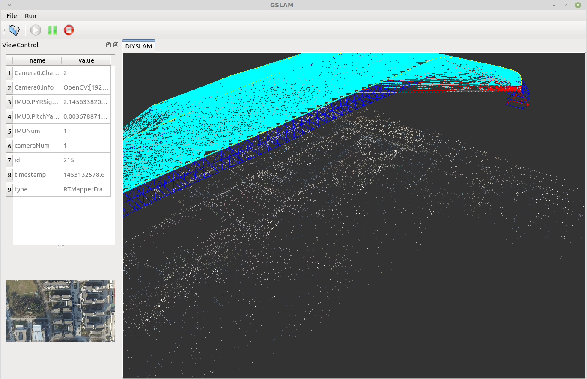

# PI-SLAM

## 1. 简介
`PI-SLAM`是西北工业大学智能系统实验室（Pilot Intelligent Laboratory, PI-LAB）开发的模块化设计的SLAM框架和系统，基于此系统能够方便的开发新的SLAM插件，从而加快研究、开发的速度。其中的FeatureDetector, Matcher, Initializer, Tracker, Mapper, Estimator, Optimizer, Relocalizer, LoopDetector and LoopCloser都可以单独实现，并不会影响其他的模块，因此能够协同开发，一定程度上降低了代码理解的难度。

在刚开始学习SLAM的时候，大部分人会面临巨大的编程技巧、复杂程序构建等方面的挑战，因此本SLAM系统各个SLAM耦合的功能拆解到独立的模块，在学习的过程可以逐个实现SLAM的模块，从而极大降低初学时的难度。

本系统将`GSLAM`和`DIYSLAM`整合在一起，并且为了降低编译的难度，将一些常用的第三方库整合在本项目中，因此仅仅依赖: `OpenCV`， `Qt`。为了方便学习和开发，最好在Linux下面来编写、编译、执行。



## 2. 编译

### 2.1 安装依赖（建议使用Ubuntu 16.04 或者 LinuxMint 18）：
```
sudo apt-get install build-essential g++ cmake git
sudo apt-get install freeglut3-dev libxmu-dev libxi-dev
sudo apt-get install libqt4-dev libqt4-opengl-dev
sudo apt-get install gcc-4.8 g++-4.8
```

### 2.2 安装OpenCV 2.4
由于本项目使用老版本的Feature，因此必须使用OpenCV 2.4。需要确保系统里没有安装其他版本的OpenCV。具体安装的方法请参考[《OpenCV安装说明》](thirdparty/opencv_install.md)


### 2.3 编译

```
mkdir build; cd build

cmake -DCMAKE_CXX_COMPILER=/usr/bin/g++-4.8 \
      -DCMAKE_C_COMPILER=/usr/bin/gcc-4.8 \
      -DOpenCV_DIR=/opt/opencv-2.4.9/share/OpenCV \
      ..

make
```

如果不出意外，编译好的程序在cmake的编译目录，即`./build`目录下

经过上面的opencv安装教程，一般 `-DOpenCV_DIR=/opt/opencv-2.4.9/share/OpenCV` 可以直接使用，或者设置成`-DOpenCV_DIR=“安装了opencv-2.4.9的目录”`

## 3. 执行

### 3.1 运行SLAM
进入到项目的`build`目录，执行
```
./pislam conf=../Default.cfg
```
该配置文件默认使用了`../../phantom3-npu/phantom3-npu.rtm` 该[phantom3-npu数据集](https://gitee.com/pi-lab/phantom3-npu)可以从这里下载。


如果希望使用其他的数据集可以运行下列命令：
```
./pislam conf=../Default.cfg Dataset=../../mavic_factory/mavic-factory.rtm
```


在配置文件(`Default.cfg`)中记录了一些参数的设置，可以通过命令行传入参数（命令行传入的参数优先级更高）。由于PI-SLAM是模块化设计的，默认配置`Default.cfg`中所使用的模块为：
* `Map`模块为`Hash`
* `LoopDetector`模块为`GPS`
* `FeatureDetector`模块为`Sift`
* `Tracker`模块为`opt`
* `Mapper`模块为`demo`
* `Matcher`模块为`bow`
* `Initializer`模块为`svd`


根据配置文件来加载不同模块的代码主要在`src/DIYSLAM.cpp`中，搜索`svar.GetString("模块名字"`能够找到对应的代码。


关于数据集可以参考`4.数据集`的部分。


### 3.2 单元测试
```
./pislam Act=Tests
```

单元测试使用了GTEST框架，具体的单元测试代码放在`./tests`目录下。**建议每个模块都进行单元测试，这样可以减少多个模块耦合之后bug不好定位的问题，此外测试代码也可以作为各个模块的使用实例代码。**


## 4 数据集
目前有两个数据集放在gitee上，具体的地址是：

* https://gitee.com/pi-lab/phantom3-npu

* https://gitee.com/pi-lab/phantom3-village-kfs-master


其他数据集包括：
1. `DroneMapUnified`: Dataset=/mnt/server0/users/zhaoyong/Dataset/NPU/DroneMap/phantom3-centralPark/phantom3-centralPark-unified/config.cfg
2. `RTMapper`: Dataset=/mnt/server0/users/zhaoyong/Dataset/NPU/RTMapper/mavic-library/mavic-library.rtm
3. `KITTI`: Dataset=/mnt/server0/users/zhaoyong/Dataset/KITTI/odomentry/color/00/mono.kitti
4. `TUMMono`: Dataset=/mnt/server0/users/zhaoyong/Dataset/TUM/Monocular/mono.tum

数据集的适配器代码放在`./gui/IO`目录下。可以参考上述的实现，通过继承`GSLAM::Dataset`来实现更多的数据集支持。


## 5. Implement your own SLAM modules

### 5.1. Modules in DIYSLAM

DIYSLAM is implemented with several modules listed below:

| ModuleName | Functional |
| ---| ---|
| Dataset         | GSLAM Module, used to load frame sequences from online or offline datasets.|
| Map             | GSLAM Module, used to manage mappoints, mapframes and loopdetector. |
| Estimator       | GSLAM Module, Used to estimate Homography, Fundamental, Essential, Affine, ICP, PnP, PlaneFit and so on.|
| Optimizer       | GSLAM Module, Used to implement bundle, pose graph optimization and so on.|
| LoopDetector    | GSLAM Module, Used to detect loops from inserted mapframes.|
| FeatureDetector | Used to detect keypoints and descriptors.|
| Matcher         | Used to find match between keypoints.|
| Tracker         | Estimate the poses of sequences frames from given map, and insert keyframes to Mapper.|
| Mapper          | Handle KeyFrames to update current map.|
| LoopCloser      | Detect and close loops.|
| Initializer     | Used by tracker to create new map.|
| Relocalizer     | Deprecated. Used by tracker to relocate frames when losted.|

### 5.2. Steps to implement your own Module

1. Create your own folder such as "zhaoyong" in "src" folder.
```
mkdir src/zhaoyong
```

2. Create your own implementation of Map, FeatureDetector, Matcher, Initializer, Tracker, Mapper, Relocalizer, LoopDetector, LoopCloser.
```
touch src/zhaoyong/MapperZhaoyong.cpp
```

3. Enable your own implementation by edit configuration file "Default.cfg" or just set when run.
```
gslam conf=../Default.cfg Dataset=<datasetfile> Mapper=Zhaoyong
```

4. Please can improve the project files edit the existed files but only your own folder, if you think revise is needed, please contact Zhaoyong (zd5945@126.com).
